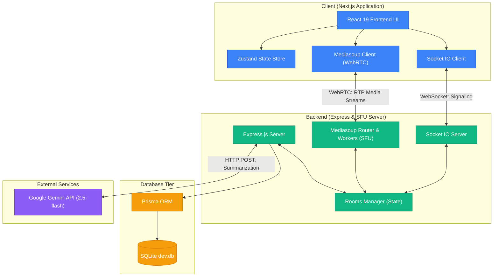

# 🔍 SupportLens

<p align="center">
  <strong>Next-Generation Real-Time Customer Support Infrastructure</strong><br />
  Built with React 19, Mediasoup WebRTC SFU, Socket.IO, and Google Gemini AI.
</p>

<p align="center">
  <a href="https://github.com/coder-rohit1477/SupportLens/blob/main/LICENSE">
    
  </a>
  
</p>

<p align="center">
  
  
  
  
  
  
  
  
  
</p>

---

## 📺 Demo & Quick Access

*   🎥 **Video Walkthrough**: [Watch on YouTube](https://youtu.be/UjYQqGsCqwc)
*   🧑‍💻 **Demo Credentials**:
    *   **Agent User**: `agent` / Password: `agent123`
    *   **Customer User**: `customer` / Password: `customer123`

---

## 💡 Overview

SupportLens is a real-time customer support platform designed for sub-second communication latency and automated post-call summarization workflows. 

### The Problem
Traditional customer support platforms are fragmented. Standard web communication systems run on peer-to-peer (Mesh) networks that slow down user devices due to heavy CPU loads. They also suffer from dropped calls when switching networks, and manual call note taking wastes hours of agent time daily.

### The Solution
SupportLens solves this by combining a low-overhead **Mediasoup SFU (Selective Forwarding Unit)** WebRTC server, a **Socket.IO signaling layer**, and a **Google Gemini AI summarization engine**. This setup runs real-time voice, video, chat, and file sharing in a single workspace. It includes a 15-second grace period that handles network drops without disconnecting calls, and automatically generates structured session summaries at the end of every session.

---

## ⚡ Implemented Features

*   **Real-Time Video & Audio**: Runs on Mediasoup SFU for sub-second stream delivery with low CPU usage on client devices.
*   **Persistent Chat**: Real-time messaging powered by Socket.IO with messages saved to the database.
*   **Contextual File Sharing**: Upload and view screenshots, documents, or logs directly inside the chat panel.
*   **AI-Powered Summaries**: Generates structured post-session summaries using the Google Gemini API.
*   **Automatic Call Recovery**: Automatically reconnects dropped client sockets within a 15-second grace window to keep call feeds active.
*   **Admin Dashboard & Metrics**: Tracks session counts, active participant details, and server uptime.
*   **Role Guarding**: Prevents duplicate agent connections to ensure session security.

---

## 🏗️ High-Level Architecture

SupportLens separates the frontend layout, signaling server, media routers, and database tier. Clients negotiate WebRTC transports over Socket.IO and send raw audio/video packets directly to Mediasoup workers.



For detailed diagrams and architectural specs, check out:
*   [Component Architecture & Topology Guide](docs/architecture.md)
*   [WebRTC & Reconnection Technical Design](docs/technical-design.md)
*   [API & WebSocket Event Reference](docs/api.md)

---

## ⚙️ Environment Configuration

Create a `.env` file in the root directory:

| Variable | Default Value | Description |
| :--- | :--- | :--- |
| `SIGNALING_PORT` | `3001` | Express backend and Socket.IO server port. |
| `NEXT_PUBLIC_APP_URL` | `http://localhost:3000` | Frontend web origin. |
| `NEXT_PUBLIC_SIGNALING_URL` | `http://localhost:3001` | Backend web origin. |
| `DATABASE_URL` | `file:./dev.db` | SQLite connection URL used by Prisma. |
| `GEMINI_API_KEY` | `""` | Gemini API key (API key from Google AI Studio). |

---

## 🚀 Installation & Local Setup

### Prerequisites
*   **Node.js**: Version `v18` or `v20`+
*   **Build Tools**: Requires a C++ compiler (such as VS Build Tools on Windows, Xcode on macOS, or GCC/G++ on Linux) to compile the native Mediasoup binaries.

### 1. Install Dependencies
Clone the repository and set up packages:
```bash
git clone https://github.com/coder-rohit1477/SupportLens.git
cd SupportLens
npm install
```

### 2. Configure Environment Variables
Create a `.env` file in the root directory:
```env
SIGNALING_PORT=3001
NEXT_PUBLIC_APP_URL="http://localhost:3000"
NEXT_PUBLIC_SIGNALING_URL="http://localhost:3001"
DATABASE_URL="file:./dev.db"
GEMINI_API_KEY="your-gemini-api-key"
```

### 3. Initialize Database Tables
Push the Prisma schemas to SQLite and generate client bindings:
```bash
npx prisma generate
npx prisma db push
```

### 4. Run Development Servers
Start both the Next.js frontend and the Express/SFU backend:
```bash
npm run dev:all
```
*   **Web Portal**: [http://localhost:3000](http://localhost:3000)
*   **Signaling API**: [http://localhost:3001](http://localhost:3001)

---

## 📸 Interface Preview

### 🔐 Login Gate
*User role selection page with preconfigured agent and customer accounts.*
*(Placeholder: `public/screenshots/auth_page.png`)*

### 💬 Active Video Call Room
*Support view combining active WebRTC video streams, text chat, and uploaded attachments.*
*(Placeholder: `public/screenshots/call_room.png`)*

### 🤖 Gemini Summary Page
*Visual details panel rendering Gemini AI-generated session summaries.*
*(Placeholder: `public/screenshots/summary_detail.png`)*

---

## 🤝 Contributing & License

Contributions are welcome. Please fork the repository, make changes in a feature branch, and submit a pull request.

This project is licensed under the **MIT License**. Check out `LICENSE` for details.
